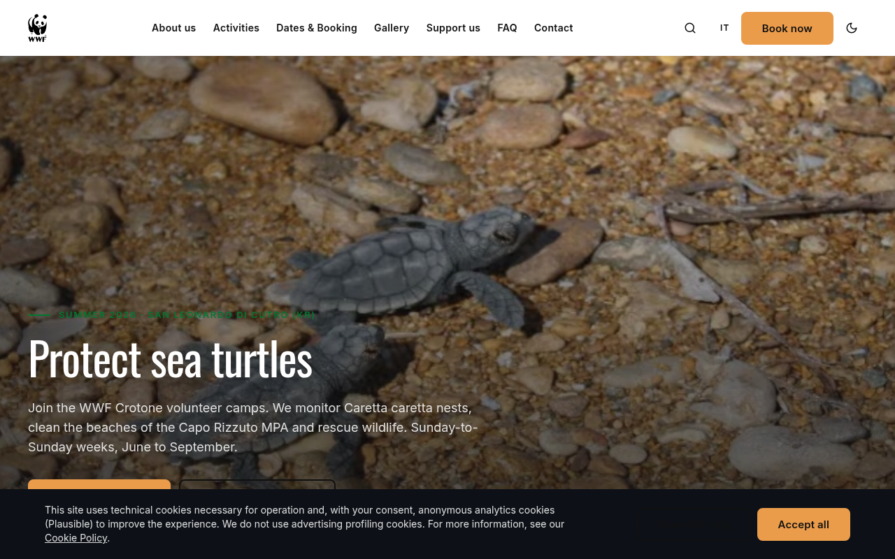
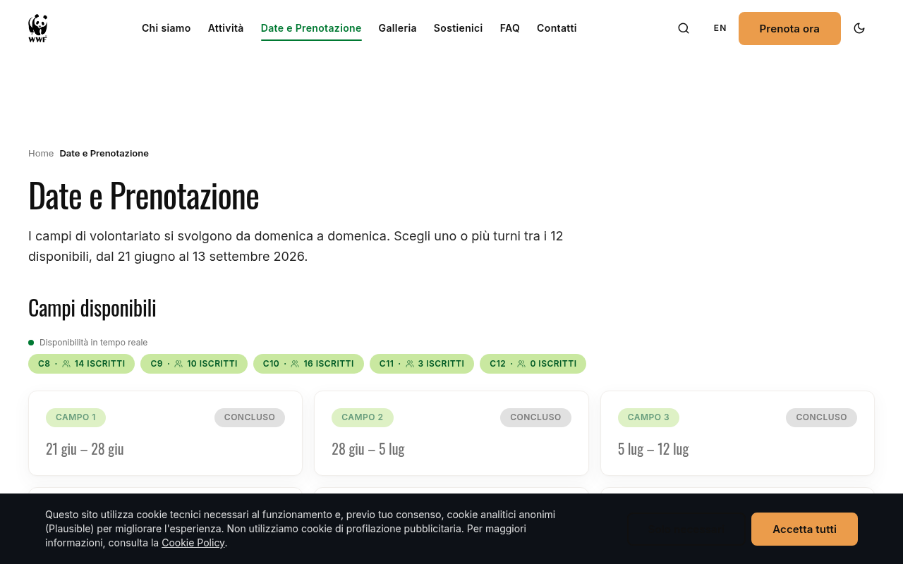
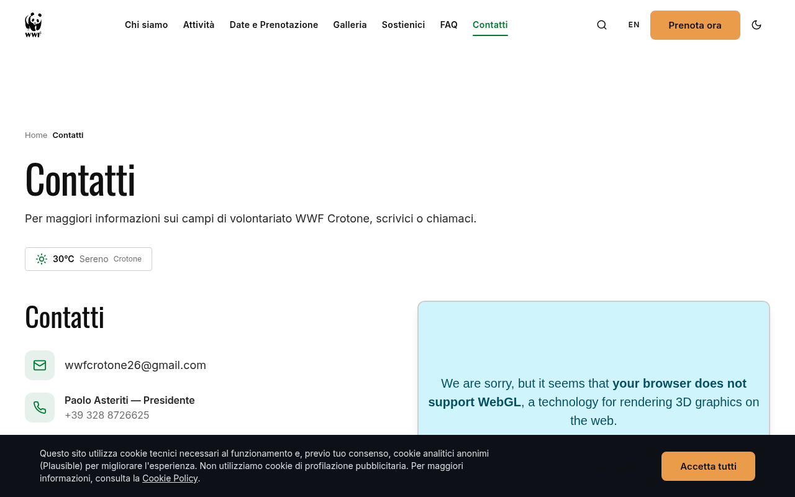
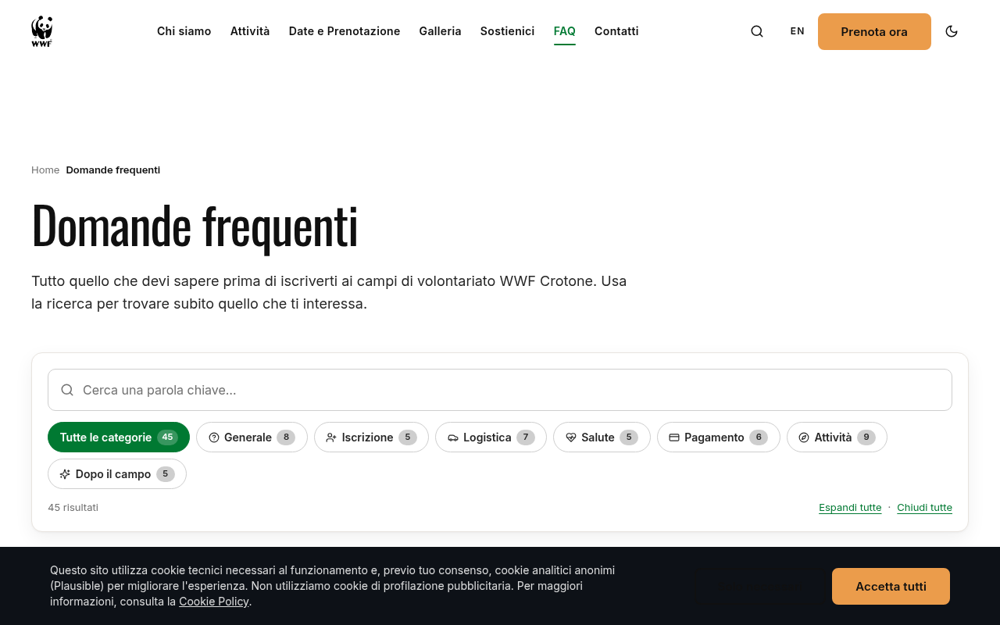
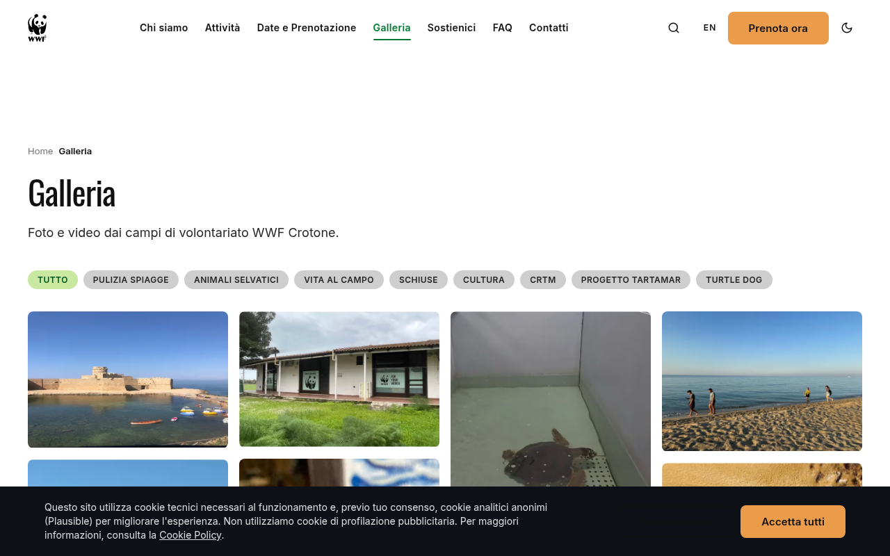
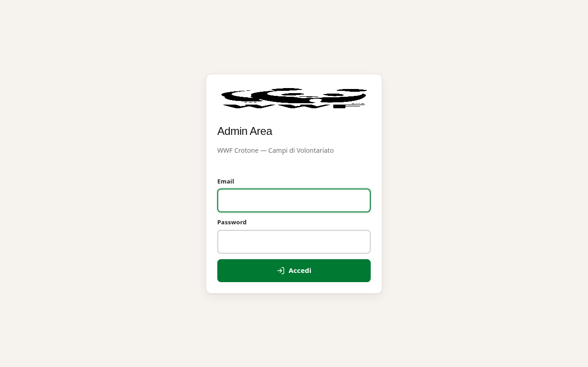
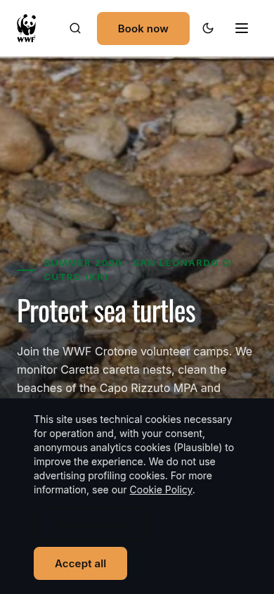

# 🌿 WWF Crotone — Campi di Volontariato 2026

Il sito ufficiale di **WWF Provincia di Crotone-ETS**, sezione locale
di WWF Italia ETS.

> 🇬🇧 [English version of this README](./README.md)

---

## Che cos'è?

Ogni estate WWF Crotone organizza **12 campi settimanali di
volontariato** (giugno – settembre) a **San Leonardo di Cutro,
Calabria**, dove i volontari aiutano a proteggere le tartarughe marine
**Caretta caretta** sulla costa ionica.

Questo sito è il punto dove:

- 📅 I volontari consultano le 12 settimane di campo e **prenotano il
  proprio posto** ([wwfcrotone.it/it/dates](https://wwfcrotone.it/it/dates))
- 🐢 Chi vuole conoscere il progetto scopre cosa si fa davvero —
  monitoraggio dei nidi di tartaruga, pulizia delle spiagge, recupero
  della fauna selvatica, biologia marina — e dove alloggiano i
  volontari (il **C.E.L.A.**, un bene confiscato alla criminalità
  organizzata e restituito alla comunità)
- 💬 I visitatori fanno domande a **Totò l'assistente virtuale**, un
  chatbot addestrato sulla brochure dei campi 2026
- 🛡️ Lo staff WWF gestisce iscrizioni, pagamenti e operatori dal
  pannello admin in italiano

Il sito è live su **[wwfcrotone.it](https://wwfcrotone.it)** e serve
circa un centinaio di volontari a stagione, oltre a un pubblico più
ampio di sostenitori e curiosi tutto l'anno.

---

## Screenshot

| Home | Campi (date + prenotazione) |
|---|---|
|  |  |
| **Contatti** | **FAQ** |
|  |  |
| **Galleria** | **Admin** (login, solo italiano) |
|  |  |

Vista mobile della homepage:



---

## Sul progetto

| | |
|---|---|
| **Organizzazione** | WWF Provincia di Crotone-ETS (ODV) |
| **Codice Fiscale** | `91034580794` |
| **Sede legale** | Località Marinella, San Leonardo di Cutro, 88842 Cutro (KR), Calabria, Italia |
| **Presidente** | Paolo Asteriti |
| **Dominio** | [wwfcrotone.it](https://wwfcrotone.it) (Aruba) |
| **Costo annuo di gestione** | ~€93/anno (dominio + VPS + tutti i free tier di terze parti) |

### Mission in una frase

> Tutelare le tartarughe marine del Mediterraneo e il loro habitat
> attraverso il monitoraggio, l'educazione e il ripristino
> dell'habitat — fatto da volontari — su un bene confiscato alla
> criminalità organizzata e restituito alla comunità.

### Cosa si fa davvero ai campi

Ogni settimana circa 15 volontari alloggiano al **C.E.L.A.** (Centro
per l'Educazione alla Legalità e all'Ambiente) e lavorano con gli
operatori WWF su:

- **Pattuglie notturne** per monitorare la deposizione di *Caretta
  caretta* sulle spiagge dell'**AMP Capo Rizzuto** (Area Marina
  Protetta Capo Rizzuto)
- **Pulizia delle spiagge** in collaborazione con i comuni locali
- **Protezione dei nidi e rilascio delle tartarughine** a fine estate
  (agosto – settembre)
- **Recupero fauna selvatica** con il **CRAS** di Catanzaro (Centro
  Recupero Animali Selvatici)
- **Attività di educazione ambientale** al **CRTM** (Centro Recupero
  Tartarughe Marine) e all'**Acquario CEAM** di Crotone
- **Citizen science** — ogni osservazione finisce nel database
  nazionale WWF

Sono 12 turni, ognuno da domenica a domenica. La maggior parte delle
settimane ha 12-20 volontari di tutte le età, con consenso dei
genitori obbligatorio per i minori. La delegazione belga è con noi da
diversi anni.

Puoi leggere la storia completa — inclusi **Totò il cane tartaruga**,
il **progetto TARTAMar** e la storia del C.E.L.A. confiscato — sulla
[ pagina FAQ](https://wwfcrotone.it/it/faq) o tramite il chatbot.

---

## Questo repository

Questo è il codice open-source che alimenta
[wwfcrotone.it](https://wwfcrotone.it). Il progetto è stato ricostruito
da zero nel 2026 con questi obiettivi:

- Un sito **bilingue** (italiano + inglese) perché i volontari
  internazionali possano iscriversi senza parlare italiano
- Un **flusso di prenotazione** che gestisce i dettagli reali:
  minori, allergie, esigenze alimentari, soggiorni multi-settimana,
  conferma del pagamento
- Un **pannello admin** che lo staff WWF possa usare senza chiamarci
  ogni volta
- Una **pipeline GDPR-compliant** con audit log completo e DPIA
  documentata
- Un **budget sotto i €200/anno** combinando una piccola VPS con i
  free tier generosi (Cloudflare, Groq, Upstash, Sentry Developer,
  Plausible, Brevo, Instatus, UptimeRobot)

### Stack, in breve

- **Next.js 15** App Router + TypeScript + Tailwind 3
- **Prisma** ORM, SQLite in dev, **PostgreSQL** in produzione
- **next-intl** per i18n italiano/inglese
- **JWT** sessions (`jose` + `bcryptjs`)
- **Nodemailer** per email transazionali (Brevo SMTP, fallback Gmail)
- **Groq** (`llama-3.3-70b-versatile`) per il chatbot
- **Leaflet + OpenStreetMap** per la mappa interattiva
- Deploy su una singola **Netcup VPS 500 G12** (2 vCPU / 4 GB /
  128 GB NVMe) con Docker Compose (Next.js + Postgres + Redis +
  Nginx + WAL-G)
- HTTPS via **Cloudflare Universal SSL** con certificato CF Origin
  per cifrare anche il tratto CF↔origin

### Layout del repository

```
docs/          # ARCHITECTURE, DPIA, SETUP, screenshot
infra/         # docker-compose, nginx, script di bootstrap VPS
prisma/        # schema, script di seed, dati import 2026
src/           # tutto il codice app (Next.js App Router)
public/        # asset statici (loghi, galleria, brochure)
.github/       # workflow CI + deploy
LICENSE*       # AGPL-3.0 (codice), CC BY-NC-SA (contenuti), trademark
```

Per l'approfondimento tecnico vedi
[`docs/ARCHITECTURE.md`](docs/ARCHITECTURE.md). Per la documentazione
GDPR vedi [`docs/DPIA.md`](docs/DPIA.md). Per **installare una copia
del sito** vedi [`docs/SETUP.md`](docs/SETUP.md).

---

## Contribuire

Questo codebase è il file di lavoro di un singolo progetto di
volontariato, non una community open-source. Siamo contenti di
condividerlo, e siamo contenti di parlare con altre ONG che vogliono
adattarlo — ma per favore non inviare PR casuali senza prima averci
scritto.

Se sei una sezione WWF o un'altra ODV italiana interessata a fare un
fork del codice, vedi [`CONTRIBUTING.md`](CONTRIBUTING.md).

Se trovi un problema di sicurezza, scrivi a **wwfcrotone26@gmail.com**
invece di aprire un'issue pubblica.

---

## Crediti

- **WWF Crotone** — Paolo Asteriti (Presidente) e tutta la squadra di
  volontari
- **Operatori dei campi** — Luca, Lorenzo, Luigi, Carlo, Elena,
  Giulia, Nadia, Nicola (nel roster operatori 2026)
- **Delegazione belga** — per essere con noi ogni anno dal 2023
- **Sviluppo sito** — Elisey Rotar
- **Fotografie** — volontari WWF Crotone + Wikimedia Commons
  (foto CC con credit inline)
- **Linguaggio visivo** — basato su [wwf.it](https://www.wwf.it)
- **AI** — powered by [Groq](https://groq.com) (`llama-3.3-70b-versatile`)
- **Hosting** — Netcup + Cloudflare
- **I volontari** — per presentarsi ogni estate

---

## Licenza

Questo repository contiene tre tipi di materiale con licenze diverse:

- **Codice sorgente** (`src/`, `prisma/`, `infra/`, `.github/`, file di
  configurazione alla root) — [AGPL-3.0](./LICENSE.code). Qualsiasi
  organizzazione che esegua una versione modificata come servizio di
  rete deve pubblicare il proprio codice sorgente.
- **Contenuti del sito** (testi, FAQ, brochure, articoli del blog,
  conoscenza del chatbot) — [CC BY-NC-SA 4.0](./LICENSE.content). Liberi
  da condividere e adattare con attribuzione, non commerciali,
  share-alike.
- **Marchi** (logo panda WWF, nome "WWF") — vedi
  [LICENSE.trademark](./LICENSE.trademark). Tutti i diritti riservati a
  WWF International / WWF Italia.

Vedi [LICENSE](./LICENSE) per il riepilogo e la logica della scelta.

---

*Costruiamo un mondo in cui le persone possano vivere in armonia con la natura.*
